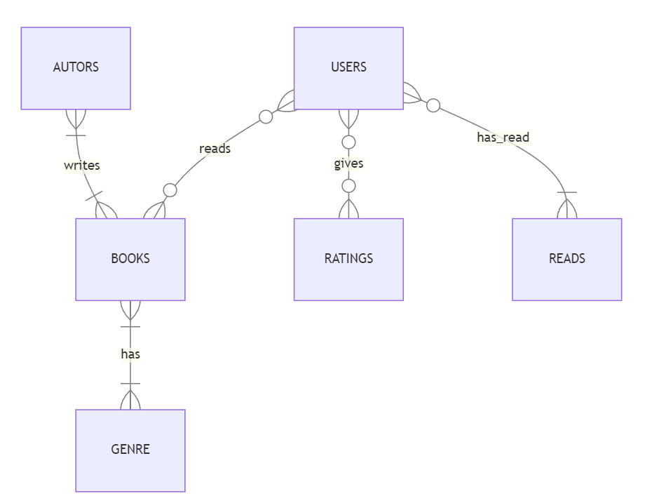

# Design Document

By Iryna Pukas

Video overview: <https://youtu.be/jx5oxT4pY10>

## Scope

* The purpose of my database is to track the books that users read, what rating they give them. Also relating books, it stores information about their authors, genres etc. It includes users, authors, books, genres, ratings and readings by the users with dates as well as ratings and comments which are optional.
* Any additional information about the books or authors is not included.

## Functional Requirements

* The user is able to enter the books they read, also dates that it took them to read the book, give it a rating and optionally comment on the book.

## Representation

Entities are captured in SQLite tables with the following schema.

### Entities

The database includes the following entities:

#### Users

The `users` table includes:

* `id`, which specifies the unique ID for the user as an `INTEGER`. This column thus has the `PRIMARY KEY` constraint applied.
* `name`, which specifies the user's name as `TEXT`, given `TEXT` is appropriate for name fields.
* `username`, which specifies the user's username. `TEXT` is used for the same reason as `name`. A `UNIQUE` constraint ensures no two users have the same  username.
* `member_since`, which specifies the date the user was signed up, it applies the `DATE` constraint to ensure the correct format is passed and makes it easier to work with the dates.

#### Books

The `books` table includes:

* `id`, which specifies the unique ID for the book as an `INTEGER`. This column thus has the `PRIMARY KEY` constraint applied.
* `title`, which specifies the book's title as `TEXT`, given it is appropriate for title fields.
* `released`, which specifies the date the book was released, it applies the `DATE` constraint to ensure the correct format is passed and makes it easier to work with the dates.

#### Authors

The `authors` table includes:

* `id`, which specifies the unique ID for the author as an `INTEGER`. This column thus has the `PRIMARY KEY` constraint applied.
* `first_name`, which specifies the author's first name as `TEXT`, given `TEXT` is appropriate for name fields.
* `last_name`, which specifies the authors's last name. `TEXT` is used for the same reason as `first_name`.

#### Authors_books

The `authors_books` table includes:

* `id`, which specifies the unique ID for the relationship as an `INTEGER`. This column thus has the `PRIMARY KEY` constraint applied.
* `author_id`, which specifies the ID for author related to `id` in table `authors`. This column thus has the `FOREIGN KEY` constraint applied.
* `book_id`, which specifies the ID for books related to `id` in table `books`. This column thus has the `FOREIGN KEY` constraint applied.

#### Genres

The `genres` table includes:

* `id`, which specifies the unique ID for the genre as an `INTEGER`. This column thus has the `PRIMARY KEY` constraint applied.
* `genre`, which specifies the genre as `TEXT`, given `TEXT` is appropriate for the field.

#### Books_genres

The `books_genres` table includes:

* `id`, which specifies the unique ID for the relationship as an `INTEGER`. This column thus has the `PRIMARY KEY` constraint applied.
* `genre_id`, which specifies the ID for genre related to `id` in table `genre`. This column thus has the `FOREIGN KEY` constraint applied.
* `book_id`, which specifies the ID for books related to `id` in table `books`. This column thus has the `FOREIGN KEY` constraint applied.

#### Reads

The `reads` table includes:

* `id`, which specifies the unique ID for the read as an `INTEGER`. This column thus has the `PRIMARY KEY` constraint applied.
* `book_id`, which specifies the ID for books related to `id` in table `books`. This column thus has the `FOREIGN KEY` constraint applied.
* `user_id`, which specifies the ID for user related to `id` in table `users`. This column thus has the `FOREIGN KEY` constraint applied.
* `date_started`, which specifies the date the users started reading the books, it applies the `DATE` constraint to ensure the correct format is passed and makes it easier to work with the dates.
* `date_finised`, which specifies the date the users finished reading the books, it applies the `DATE` constraint to ensure the correct format is passed and makes it easier to work with the dates.

#### Ratings

The `ratings` table includes:

* `id`, which specifies the unique ID for the read as an `INTEGER`. This column thus has the `PRIMARY KEY` constraint applied.
* `book_id`, which specifies the ID for book related to `id` in table `books`. This column thus has the `FOREIGN KEY` constraint applied.
* `user_id`, which specifies the ID for user related to `id` in table `users`. This column thus has the `FOREIGN KEY` constraint applied.
* `read_id`, which specifies the ID for read related to `id` in table `reads`. This column thus has the `FOREIGN KEY` constraint applied.
* `rating`, which specifies the rating the user had given to the book they had read, it should be from 0 to 10 with two decimal places.
* `date`, which specifies the date the rating was given, it applies the `DATE` constraint to ensure the correct format is passed and makes it easier to work with the dates.
* `comment`, which specifies the comment the user had given to the book, it is optional.

### Relationships

* A user is able to read multiple books, but they might have a single entry as read and rating for a specified book.
* Ratings are given by users. One user can give multiple ratings for different books.
* Books are written by authors. More than one book can be written by one or multiple authors.
* Books can have one or multiple genres.

## Optimizations

* There are indexes to facilitate the search of books by title, authors by their first and last name, users by their usernames and rating by the date they were given.
* Also there's a view to see the books that had been read by the users in the year 2022.

## Limitations

* It might be considred too laborious to enter the whole data. The improvement might be thinking on optimizing the database more.
